# MPT (Movement Performance Training) Web Application - UML Use Case Diagram

## System Overview
The MPT web application is a comprehensive water sports training platform offering kitesurfing, hydrofoiling, and wing foiling services with booking, payment, and content management capabilities.

## UML Use Case Diagram

```mermaid
graph TB
    %% System Boundary
    subgraph MPT["MPT Web Application System"]
        %% Customer Use Cases
        UC1[("View Home Page")]
        UC2[("Browse Services")]
        UC3[("View Gallery")]
        UC4[("Read About Us")]
        UC5[("Contact Us")]
        UC6[("View Resources")]
        UC7[("Book Training Session")]
        UC8[("Make Payment")]
        UC9[("View FAQ")]
        UC10[("View Privacy Policy")]
        UC11[("View Terms of Service")]
        UC12[("Use Chatbot")]
        UC13[("View Weather Widget")]
        UC14[("Use Interactive Map")]
        UC15[("Download PDF Resources")]
        UC16[("View Training Videos")]
        UC17[("Read Testimonials")]
        UC18[("Submit Contact Form")]
        
        %% Admin Use Cases
        UC19[("Login to Admin Panel")]
        UC20[("View Dashboard")]
        UC21[("Manage Bookings")]
        UC22[("Manage Testimonials")]
        UC23[("Manage Gallery")]
        UC24[("Manage Team Members")]
        UC25[("Upload Videos")]
        UC26[("View Analytics")]
        UC27[("Manage Services")]
        UC28[("Manage Packages")]
        UC29[("Update Booking Status")]
        UC30[("Delete Bookings")]
        UC31[("Export Data")]
        UC32[("Manage User Roles")]
        
        %% System Use Cases
        UC33[("Process Payments")]
        UC34[("Send Email Notifications")]
        UC35[("Generate Reports")]
        UC36[("Validate Forms")]
        UC37[("Store Data")]
        UC38[("Retrieve Weather Data")]
        UC39[("Handle Authentication")]
        UC40[("Manage Sessions")]
    end
    
    %% Actors
    Customer[("Customer")]
    Admin[("Admin")]
    StripeAPI[("Stripe API")]
    WeatherAPI[("Weather API")]
    MapsAPI[("Maps API")]
    
    %% Customer Relationships
    Customer --- UC1
    Customer --- UC2
    Customer --- UC3
    Customer --- UC4
    Customer --- UC5
    Customer --- UC6
    Customer --- UC7
    Customer --- UC8
    Customer --- UC9
    Customer --- UC10
    Customer --- UC11
    Customer --- UC12
    Customer --- UC13
    Customer --- UC14
    Customer --- UC15
    Customer --- UC16
    Customer --- UC17
    Customer --- UC18
    
    %% Admin Relationships
    Admin --- UC19
    Admin --- UC20
    Admin --- UC21
    Admin --- UC22
    Admin --- UC23
    Admin --- UC24
    Admin --- UC25
    Admin --- UC26
    Admin --- UC27
    Admin --- UC28
    Admin --- UC29
    Admin --- UC30
    Admin --- UC31
    Admin --- UC32
    
    %% External System Relationships
    StripeAPI --- UC33
    WeatherAPI --- UC38
    MapsAPI --- UC14
    
    %% Include Relationships
    UC7 -.->|includes| UC8
    UC7 -.->|includes| UC33
    UC8 -.->|includes| UC34
    UC18 -.->|includes| UC34
    UC19 -.->|includes| UC39
    UC21 -.->|includes| UC29
    UC21 -.->|includes| UC30
    UC25 -.->|includes| UC16
    UC15 -.->|includes| UC37
    UC12 -.->|includes| UC37
    UC13 -.->|includes| UC38
    
    %% Extend Relationships
    UC8 -.->|extends| UC7
    UC34 -.->|extends| UC8
    UC34 -.->|extends| UC18
    UC39 -.->|extends| UC19
    UC29 -.->|extends| UC21
    UC30 -.->|extends| UC21
    UC16 -.->|extends| UC25
    UC37 -.->|extends| UC15
    UC37 -.->|extends| UC12
    UC38 -.->|extends| UC13
    
    %% Styling
    classDef customerUC fill:#e1f5fe,stroke:#01579b,stroke-width:2px
    classDef adminUC fill:#f3e5f5,stroke:#4a148c,stroke-width:2px
    classDef systemUC fill:#e8f5e8,stroke:#1b5e20,stroke-width:2px
    classDef actor fill:#fff3e0,stroke:#e65100,stroke-width:3px
    classDef external fill:#ffebee,stroke:#c62828,stroke-width:2px
    
    class UC1,UC2,UC3,UC4,UC5,UC6,UC7,UC8,UC9,UC10,UC11,UC12,UC13,UC14,UC15,UC16,UC17,UC18 customerUC
    class UC19,UC20,UC21,UC22,UC23,UC24,UC25,UC26,UC27,UC28,UC29,UC30,UC31,UC32 adminUC
    class UC33,UC34,UC35,UC36,UC37,UC38,UC39,UC40 systemUC
    class Customer,Admin actor
    class StripeAPI,WeatherAPI,MapsAPI external
```

## Detailed Use Case Descriptions

### Customer Use Cases

#### UC1: View Home Page
- **Description**: Customer accesses the main landing page with hero section, features, testimonials, and company information
- **Preconditions**: None
- **Main Flow**: Customer navigates to homepage, views content, interacts with elements
- **Postconditions**: Customer can navigate to other sections

#### UC2: Browse Services
- **Description**: Customer views available training services (kitesurfing, hydrofoiling, wing foiling)
- **Preconditions**: None
- **Main Flow**: Customer selects Services page, views service details and pricing
- **Postconditions**: Customer understands available services

#### UC3: View Gallery
- **Description**: Customer browses photos and videos of training sessions, facilities, and team
- **Preconditions**: None
- **Main Flow**: Customer selects Gallery, filters by category, views media
- **Postconditions**: Customer sees visual content

#### UC4: Read About Us
- **Description**: Customer learns about company story, values, team, and achievements
- **Preconditions**: None
- **Main Flow**: Customer accesses About page, reads company information
- **Postconditions**: Customer understands company background

#### UC5: Contact Us
- **Description**: Customer views contact information and location details
- **Preconditions**: None
- **Main Flow**: Customer accesses Contact page, views contact details and map
- **Postconditions**: Customer has contact information

#### UC6: View Resources
- **Description**: Customer accesses downloadable PDFs, guides, and educational content
- **Preconditions**: None
- **Main Flow**: Customer selects Resources, downloads PDFs (Safety guides, meal plans, recipes)
- **Postconditions**: Customer has access to educational materials

#### UC7: Book Training Session
- **Description**: Customer books a training session by selecting package, date, and time
- **Preconditions**: Customer must provide contact information
- **Main Flow**: 
  1. Customer selects package (Free Consultation, Basic, Premium, Deluxe, VIP)
  2. Customer enters personal details
  3. Customer selects date and time
  4. Customer adds special requests
  5. System validates information
- **Postconditions**: Booking request is created

#### UC8: Make Payment
- **Description**: Customer processes payment for booked training session
- **Preconditions**: Customer has completed booking form
- **Main Flow**: 
  1. Customer reviews booking details
  2. Customer enters payment information
  3. System processes payment via Stripe
  4. Payment confirmation is sent
- **Postconditions**: Payment is processed, booking is confirmed

#### UC9: View FAQ
- **Description**: Customer reads frequently asked questions and answers
- **Preconditions**: None
- **Main Flow**: Customer accesses FAQ page, reads questions and answers
- **Postconditions**: Customer has answers to common questions

#### UC10: View Privacy Policy
- **Description**: Customer reads privacy policy and data handling information
- **Preconditions**: None
- **Main Flow**: Customer accesses Privacy page, reads policy
- **Postconditions**: Customer understands privacy practices

#### UC11: View Terms of Service
- **Description**: Customer reads terms and conditions
- **Preconditions**: None
- **Main Flow**: Customer accesses Terms page, reads terms
- **Postconditions**: Customer understands terms

#### UC12: Use Chatbot
- **Description**: Customer interacts with AI chatbot for quick questions and support
- **Preconditions**: None
- **Main Flow**: 
  1. Customer opens chatbot
  2. Customer asks questions
  3. Bot provides responses
  4. Customer can ask follow-up questions
- **Postconditions**: Customer receives assistance

#### UC13: View Weather Widget
- **Description**: Customer checks current weather conditions and forecasts
- **Preconditions**: None
- **Main Flow**: 
  1. Customer opens weather widget
  2. System fetches weather data
  3. Customer views current conditions and forecast
- **Postconditions**: Customer has weather information

#### UC14: Use Interactive Map
- **Description**: Customer views location and gets directions
- **Preconditions**: None
- **Main Flow**: 
  1. Customer opens map
  2. Customer views MPT location
  3. Customer can get directions
- **Postconditions**: Customer knows how to reach location

#### UC15: Download PDF Resources
- **Description**: Customer downloads educational PDFs (safety guides, meal plans, recipes)
- **Preconditions**: None
- **Main Flow**: 
  1. Customer selects resource
  2. Customer clicks download
  3. PDF is downloaded to device
- **Postconditions**: Customer has PDF resource

#### UC16: View Training Videos
- **Description**: Customer watches training videos and demonstrations
- **Preconditions**: None
- **Main Flow**: Customer selects video, plays content
- **Postconditions**: Customer views training content

#### UC17: Read Testimonials
- **Description**: Customer reads customer reviews and testimonials
- **Preconditions**: None
- **Main Flow**: Customer views testimonials on homepage or dedicated section
- **Postconditions**: Customer sees social proof

#### UC18: Submit Contact Form
- **Description**: Customer sends inquiry through contact form
- **Preconditions**: Customer must provide required information
- **Main Flow**: 
  1. Customer fills contact form
  2. Customer submits form
  3. System sends email notification
- **Postconditions**: Inquiry is sent to admin

### Admin Use Cases

#### UC19: Login to Admin Panel
- **Description**: Admin authenticates to access admin dashboard
- **Preconditions**: Admin must have valid credentials
- **Main Flow**: 
  1. Admin enters username and password
  2. System validates credentials
  3. Admin gains access to dashboard
- **Postconditions**: Admin is authenticated

#### UC20: View Dashboard
- **Description**: Admin views system overview with metrics and statistics
- **Preconditions**: Admin must be logged in
- **Main Flow**: Admin accesses dashboard, views key metrics
- **Postconditions**: Admin sees system status

#### UC21: Manage Bookings
- **Description**: Admin views, updates, and manages customer bookings
- **Preconditions**: Admin must be logged in
- **Main Flow**: 
  1. Admin views booking list
  2. Admin can filter and search bookings
  3. Admin can update booking status
  4. Admin can delete bookings
- **Postconditions**: Bookings are managed

#### UC22: Manage Testimonials
- **Description**: Admin adds, edits, and manages customer testimonials
- **Preconditions**: Admin must be logged in
- **Main Flow**: 
  1. Admin views testimonial list
  2. Admin can add new testimonials
  3. Admin can edit existing testimonials
  4. Admin can delete testimonials
- **Postconditions**: Testimonials are updated

#### UC23: Manage Gallery
- **Description**: Admin uploads, organizes, and manages gallery images
- **Preconditions**: Admin must be logged in
- **Main Flow**: 
  1. Admin views gallery items
  2. Admin can upload new images
  3. Admin can categorize images
  4. Admin can delete images
- **Postconditions**: Gallery is updated

#### UC24: Manage Team Members
- **Description**: Admin manages team member information and profiles
- **Preconditions**: Admin must be logged in
- **Main Flow**: 
  1. Admin views team members
  2. Admin can add new team members
  3. Admin can edit member information
  4. Admin can remove team members
- **Postconditions**: Team information is updated

#### UC25: Upload Videos
- **Description**: Admin uploads training videos and content
- **Preconditions**: Admin must be logged in
- **Main Flow**: 
  1. Admin selects video file
  2. Admin uploads video
  3. System processes video
- **Postconditions**: Video is available to customers

#### UC26: View Analytics
- **Description**: Admin views system analytics and performance metrics
- **Preconditions**: Admin must be logged in
- **Main Flow**: Admin accesses analytics dashboard, views metrics
- **Postconditions**: Admin has performance data

#### UC27: Manage Services
- **Description**: Admin manages available services and pricing
- **Preconditions**: Admin must be logged in
- **Main Flow**: 
  1. Admin views services list
  2. Admin can add new services
  3. Admin can edit service details
  4. Admin can deactivate services
- **Postconditions**: Services are updated

#### UC28: Manage Packages
- **Description**: Admin manages training packages and pricing
- **Preconditions**: Admin must be logged in
- **Main Flow**: 
  1. Admin views packages list
  2. Admin can add new packages
  3. Admin can edit package details
  4. Admin can adjust pricing
- **Postconditions**: Packages are updated

#### UC29: Update Booking Status
- **Description**: Admin changes booking status (pending, confirmed, cancelled)
- **Preconditions**: Admin must be logged in, booking must exist
- **Main Flow**: 
  1. Admin selects booking
  2. Admin changes status
  3. System updates booking
- **Postconditions**: Booking status is updated

#### UC30: Delete Bookings
- **Description**: Admin removes bookings from system
- **Preconditions**: Admin must be logged in, booking must exist
- **Main Flow**: 
  1. Admin selects booking
  2. Admin confirms deletion
  3. System removes booking
- **Postconditions**: Booking is deleted

#### UC31: Export Data
- **Description**: Admin exports system data for reporting
- **Preconditions**: Admin must be logged in
- **Main Flow**: 
  1. Admin selects data type
  2. Admin initiates export
  3. System generates export file
- **Postconditions**: Data is exported

#### UC32: Manage User Roles
- **Description**: Admin manages user roles and permissions
- **Preconditions**: Admin must be logged in
- **Main Flow**: 
  1. Admin views users
  2. Admin can change user roles
  3. Admin can remove users
- **Postconditions**: User roles are updated

### System Use Cases

#### UC33: Process Payments
- **Description**: System processes customer payments through Stripe
- **Preconditions**: Payment information must be valid
- **Main Flow**: 
  1. System receives payment request
  2. System validates payment data
  3. System processes payment with Stripe
  4. System confirms payment
- **Postconditions**: Payment is processed

#### UC34: Send Email Notifications
- **Description**: System sends automated email notifications
- **Preconditions**: Email addresses must be valid
- **Main Flow**: 
  1. System triggers email event
  2. System generates email content
  3. System sends email
- **Postconditions**: Email is sent

#### UC35: Generate Reports
- **Description**: System generates various reports and analytics
- **Preconditions**: Data must be available
- **Main Flow**: 
  1. System collects data
  2. System processes data
  3. System generates report
- **Postconditions**: Report is available

#### UC36: Validate Forms
- **Description**: System validates form input data
- **Preconditions**: Form data must be submitted
- **Main Flow**: 
  1. System receives form data
  2. System validates required fields
  3. System validates data format
  4. System returns validation results
- **Postconditions**: Form is validated

#### UC37: Store Data
- **Description**: System stores data in database
- **Preconditions**: Data must be valid
- **Main Flow**: 
  1. System receives data
  2. System validates data
  3. System stores in database
- **Postconditions**: Data is stored

#### UC38: Retrieve Weather Data
- **Description**: System fetches weather information from external API
- **Preconditions**: Weather API must be available
- **Main Flow**: 
  1. System requests weather data
  2. System receives weather information
  3. System processes data
- **Postconditions**: Weather data is available

#### UC39: Handle Authentication
- **Description**: System manages user authentication and sessions
- **Preconditions**: User must have credentials
- **Main Flow**: 
  1. System receives login request
  2. System validates credentials
  3. System creates session
- **Postconditions**: User is authenticated

#### UC40: Manage Sessions
- **Description**: System manages user sessions and tokens
- **Preconditions**: User must be authenticated
- **Main Flow**: 
  1. System creates session
  2. System manages session state
  3. System handles session expiration
- **Postconditions**: Session is managed

## Key Features Summary

### Customer-Facing Features:
- **Training Services**: Kitesurfing, Hydrofoiling, Wing Foiling
- **Booking System**: 5 package tiers (Free Consultation to VIP)
- **Payment Processing**: Stripe integration
- **Interactive Elements**: Chatbot, Weather Widget, Interactive Map
- **Content Management**: Gallery, Videos, PDF Resources
- **Communication**: Contact forms, FAQ, Testimonials

### Admin Features:
- **Dashboard**: Analytics and metrics
- **Content Management**: Bookings, Testimonials, Gallery, Team
- **User Management**: Authentication, roles, permissions
- **Data Management**: Export, reporting, analytics

### System Features:
- **Payment Processing**: Stripe integration
- **Email Notifications**: Automated communications
- **Data Validation**: Form validation and data integrity
- **External Integrations**: Weather API, Maps API
- **Security**: Authentication and session management

This use case diagram represents the complete functionality of your MPT web application, showing all user interactions, admin capabilities, and system processes.
